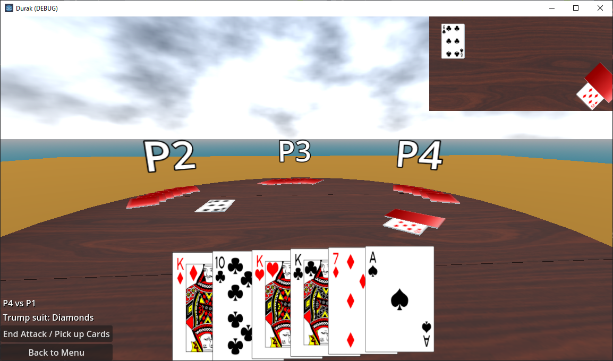

# Durak
A 3D Durak card game written in C# and using Godot game engine.

## Features
- 2-6 player individual game
- Card animations
- Moveable camera
- Expandable mini-map

## Controls
- Left mouse button = Play the card or interact with the menu buttons. Also used to expand and collapse the mini-map.
- Middle mouse button = Look around
- Arrow up/down = Go forwards/backwards into the current direction
- F1, F2, F3 = jump to one of camera location presets

## TODO 
- Test disabled animations still work
- Animation improvements (computer picks up and immediately places card on table isn't shown)
- Fix and update tests
- More tests to fully cover all game scenarios
- Expose settings (animation, animation speed, etc.)
- Customization (tables, card backs)
- Add attacker button
- Improve computer play
- Improve debug logging (who is attacking, etc)
- Partnership game support
- Cleanup without exceptions on back to menu button press 
- Code refactor in Durak.Godot to do one thing at a time (click, animate, animation ends, etc based on main loop)
- Fix end attack button spamming

## Misc
- Folder structure and solution name are restricted by https://github.com/godotengine/godot-proposals/issues/2646
- 3D table models from https://creazilla.com/media/3d-model/39194/set-of-tables-and-desks
