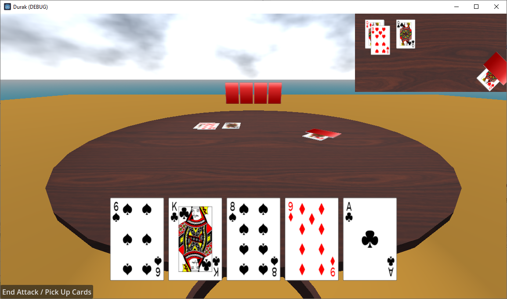
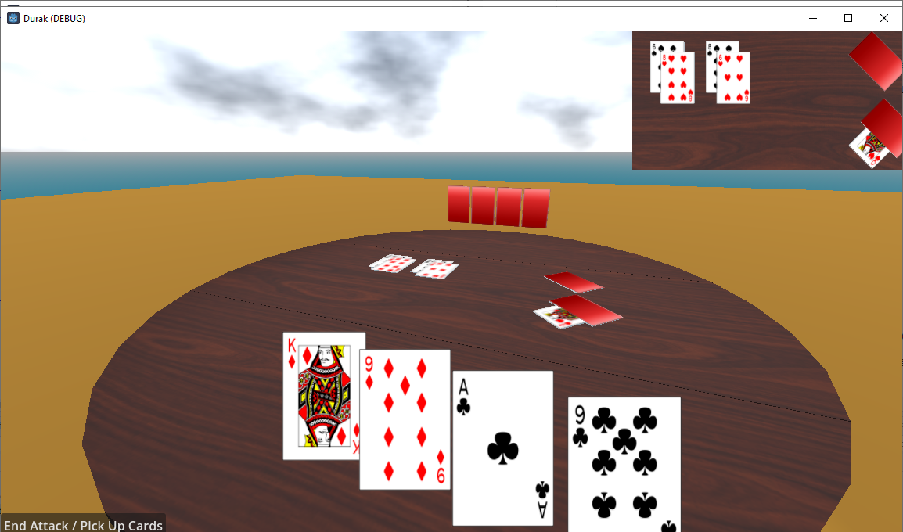

# Durak
A 3D Durak card game written in C# and using Godot game engine.

## Features
- 2 player individual game
- Card animations
- Moveable camera

## Controls
- Left mouse button = play the card or interact with the menu buttons
- Middle mouse button = look around
- Arrow up/down = go forwards/backwards into current direction

## TODO 
1. 3-6 player individual game support
2. Partnership game support
3. Full screen mini map toggle
4. Larger hand fitting in the screen
5. Better card rotation centering when moving away from the initial starting position
6. Fix and update tests
7. More tests to fully cover all game scenarios
8. Expose settings (animation, animation speed, etc.)
9. Customization (tables, card backs)
