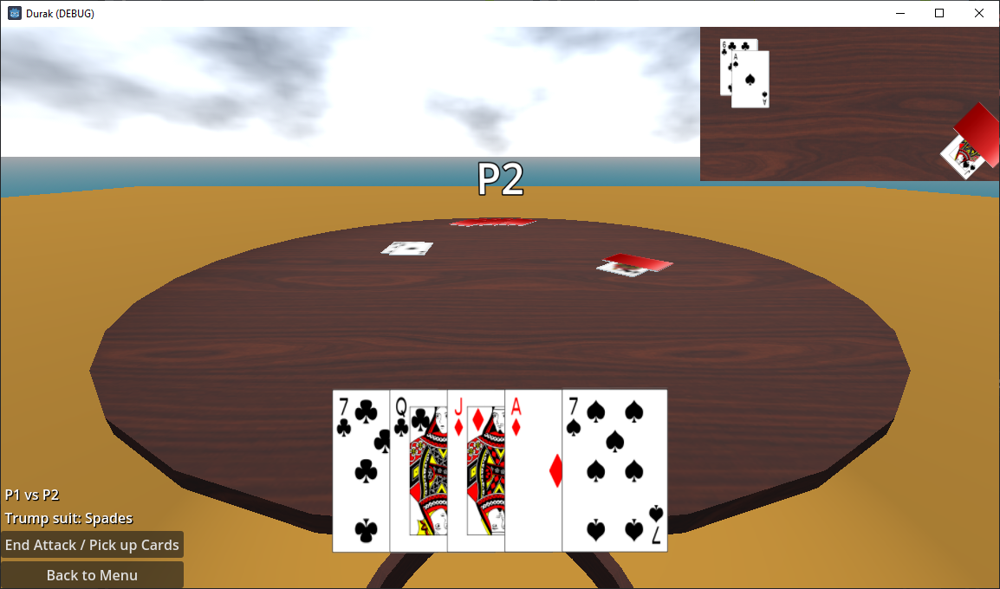
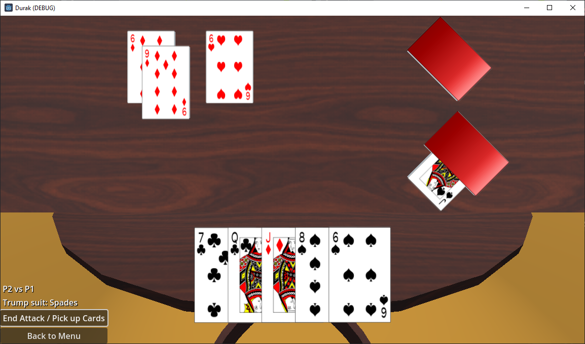

# Durak
A 3D Durak card game written in C# and using Godot game engine.

## Features
- 2-6 player individual game
- Card animations
- Moveable camera

## Controls
- Left mouse button = play the card or interact with the menu buttons
- Middle mouse button = look around
- Arrow up/down = go forwards/backwards into current direction

## TODO 
- Show current attack in text (P1 vs P2, etc)
- Test disabled animations still work
- Keep order when picking up cards
- Animation improvements (computer picks up and immediately places card on table isn't shown)
- Show player names
- Place non main player hands on the table
- Fix and update tests
- More tests to fully cover all game scenarios
- Expose settings (animation, animation speed, etc.)
- Customization (tables, card backs)
- Add attacker button
- Improve computer play
- Improve debug logging (who is attacking, etc)
- Partnership game support
- Cleanup without exceptions on back to menu button press 
- Code refactor in Durak.Godot to do one thing at a time (click, animate, animation ends, etc based on main loop)
- Fix end attack button spamming